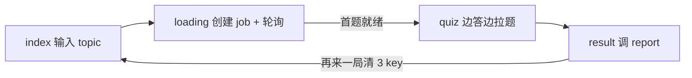
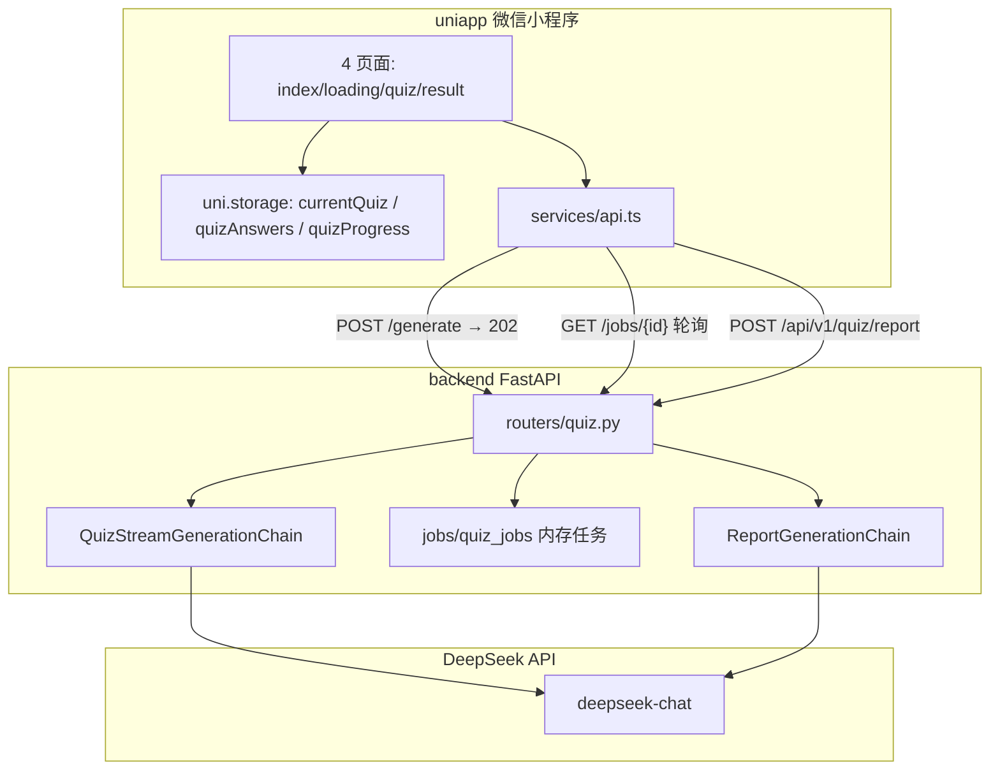

# 知练（KnowPractice）— MVP 开发实施指南

> **文档性质：** 开发阶段执行手册（文档先行，代码尚未启动）。  
> **产品品牌：** 知练（KnowPractice）。  
> **依据：** [方案设计文档 v1.3.0](./交互式AI闯关学习微信小程序方案设计文档.md) · [需求分析（合并精简版）](./交互式AI闯关学习微信小程序需求分析文档%20(合并精简版).md) · [UI 页面原型说明](./UI页面原型说明.md)

| 版本 | 日期 | 说明 |
| ---- | ---- | ---- |
| v1.0.0 | 2026-05-29 | 初版：Sprint 1–4、G0–G4 验收闸门、环境搭建、排期与风险 |

---

## 一、现状与目标

### 1.1 仓库现状

| 维度 | 状态 |
| ---- | ---- |
| 需求 / 方案 | ✅ 已定稿 |
| UI 高保真原型 | ✅ [`prototypes/`](../prototypes/)（MVP 9 屏 + 扩展 / 报告） |
| 可运行代码 | ❌ 尚无 `backend/`、`uniapp/` |
| 本文档集 | ✅ 开发实施指南 + API 契约 + 前端指引 |

### 1.2 MVP 核心闭环

```
用户输入一句话 → AI 生成 10 道题 → 用户答题闯关 → AI 生成复盘报告
```



### 1.3 成功标准

- 本地环境可完整跑通上述闭环
- 10 题支持 `single` / `multiple` / `judge` 三种题型
- 每题答完即时反馈（绿 / 红 + 震动 + 解析 + 答对音效）
- 结算页展示正确率、**知识点掌握情况**（本地即时）与 **AI 结构化复盘**（异步卡片）
- 微信开发者工具体验版可内测

---

## 二、技术架构



### 2.1 关键技术决策（不可偏离）

| 维度 | 决策 |
| ---- | ---- |
| 前端 | uni-app + Vue 3 + TypeScript + Vite CLI（不用 HBuilderX） |
| 后端 | Python FastAPI + LangChain + DeepSeek |
| JSON 命名 | **全链路 snake_case**（`quiz_id`、`correct_rate`） |
| 存储 | 无数据库；3 个 `uni.storage` key；禁止 `clearStorage()` |
| 判分 | 前端本地判分（多选为集合相等） |
| Markdown | towxml 首选；超 1 天则 `\n\n` 分段 `<view>` 降级 |

### 2.2 Monorepo 目标目录

```
AI-Learn/
├── uniapp/                     # Sprint 2 创建
│   ├── src/
│   │   ├── pages/              # index / loading / quiz / result
│   │   ├── components/
│   │   ├── services/api.ts
│   │   ├── utils/              # scoring.ts, storage.ts
│   │   └── types/quiz.ts
│   ├── pages.json
│   └── manifest.json
├── backend/                    # Sprint 1 创建
│   ├── app/
│   │   ├── main.py
│   │   ├── routers/quiz.py
│   │   ├── chains/
│   │   ├── schemas/quiz.py
│   │   └── prompts/
│   ├── tests/
│   └── requirements.txt
├── prototypes/                 # 已有：UI 对照
└── docs/                       # 已有 + 本指南
```

---

## 三、验收闸门 G0–G4

| 闸门 | Sprint | 做什么 | 怎么验证 | 通过标准 |
| ---- | ------ | ------ | -------- | -------- |
| **G0** | Sprint 2 初 | 初始化 uni-app，4 空页可跳转 | 微信开发者工具 | index→loading→quiz→result 链通 |
| **G1** | Sprint 1 | 后端 generate/report 接口 | `curl` + `/docs` | 返回 10 题 JSON + Markdown 报告 |
| **G2** | Sprint 2 | Mock 数据走完 10 题 | 微信工具 | 3 题型 + 震动 + 解析 + scroll-view |
| **G3** | Sprint 3 | 真实 AI 出题联调 | 输入 topic | loading 进度条 → 10 题真实数据 |
| **G4** | Sprint 4 | 完整闭环 | 端到端一次 | 结算页 AI 报告 + 再来一局 |

**执行顺序：** G0 与 G1 可并行；G2 依赖 G0；G3 依赖 G1+G2；G4 依赖 G3。

---

## 四、分阶段实施（Sprint 1–4）

### Day 0 — 环境准备（0.5 天）

| 步骤 | 动作 | 完成标志 |
| ---- | ---- | -------- |
| 1 | 安装 Node 18+、Python 3.11+、微信开发者工具 | 版本命令可执行 |
| 2 | 申请 DeepSeek API Key | 写入 `backend/.env` |
| 3 | 注册小程序 AppID 或使用测试号 | 可创建小程序项目 |
| 4 | 克隆 / 打开 `AI-Learn/` | Monorepo 目录就绪 |

### Sprint 1 — 后端 AI 链路（G1，2–3 天）

**目标：** `curl` 可调通 `/api/v1/quiz/generate` 与 `/api/v1/quiz/report`

| 任务 | 产出 |
| ---- | ---- |
| 初始化 `backend/` | FastAPI + CORS + `/health` |
| `QuizGenerationChain` | 输入 `{ topic }` → 10 题 JSON |
| `ReportGenerationChain` | 输入答题记录 → 结构化 JSON 复盘（`学习复盘报告`） |
| Pydantic Schema + 题型校验 | `tests/test_schemas.py` 通过 |
| OpenAPI | `/docs` 可调试 |

**G1 验收：**

```bash
curl -X POST http://127.0.0.1:8000/api/v1/quiz/generate \
  -H "Content-Type: application/json" \
  -d '{"topic":"光合作用"}'
```

详细 API、Schema、Prompt 见 [MVP后端API与数据契约.md](./MVP后端API与数据契约.md)。

### Sprint 2 — uni-app 骨架 + Mock 答题（G0 + G2，3–4 天）

**目标：** 微信开发者工具内 Mock 数据走完 10 题

**初始化：**

```bash
npx degit dcloudio/uni-preset-vue#vite-ts uniapp
cd uniapp && npm install
npm run dev:mp-weixin
# 微信开发者工具 → 导入 uniapp/dist/dev/mp-weixin
```

| 任务 | 产出 |
| ---- | ---- |
| 配置 `pages.json` 四页面 | G0 跳转链通 |
| Mock 题目（含超长题干/解析） | 覆盖 3 题型 |
| quiz 页 Flex + scroll-view | 小屏不截断 |
| 正误反馈 + 震动 + 音效 | 交互达标 |
| `scoring.ts` + storage 三 key | 进度可恢复 |

**G2 验收：** Mock 走完 10 题 → result 页展示静态报告文本

页面、组件、UI 映射见 [MVP前端实现指引.md](./MVP前端实现指引.md)。

### Sprint 3 — 前后端联调（G3，2 天）

| 任务 | 产出 |
| ---- | ---- |
| `services/api.ts` 对接 generate | 真实题目 |
| loading 心理学进度条 + 文案轮播 | 15–30s 可接受 |
| loading `onUnload` 取消请求 | 无幽灵跳转 |
| snake_case 联调 | 无 undefined |
| 超时/502 Toast + 回首页 | 异常路径 |
| 真机 `BASE_URL` 改局域网 IP | 真机可达 |

**G3 验收：** 真实 topic → 10 题 → 结算页（报告可仍用静态）

### Sprint 4 — 复盘报告 + 打磨（G4，2–3 天）

| 任务 | 产出 |
| ---- | ---- |
| 对接 `/api/v1/quiz/report` | 结构化 JSON 复盘 |
| `BentoKnowledgePanel` + `BentoReportCards` | 知识点与 AI 报告分卡，默认收起 |
| `structuredReport.ts` + `ReportView` 兜底 | JSON 卡片渲染；解析失败保留本地摘要 |
| 再来一局删 3 个 storage key | 禁止 `clearStorage` |
| Prompt 调优 + UI 对齐屏⑧ | 内测可用 |
| 分享按钮置灰 | MVP 不做 |

**G4 验收：** 完整闭环可演示；内测 3–5 个 topic 验证题目质量

---

## 五、日常开发循环

```bash
# 终端 1：后端（Sprint 1 起）
cd backend
python -m venv .venv
.venv\Scripts\activate          # Windows
pip install -r requirements.txt
cp .env.example .env            # 填入 DEEPSEEK_API_KEY
uvicorn app.main:app --reload --host 0.0.0.0 --port 8000

# 终端 2：前端（Sprint 2 起）
cd uniapp
npm install
cp .env.development.example .env.development   # 真机：填入电脑局域网 IP
npm run dev:mp-weixin

# 微信开发者工具
# → 导入 uniapp/dist/dev/mp-weixin
# → 详情 → 本地设置 → 勾选「不校验合法域名、web-view...」
# → 真机预览：手机与电脑同一 Wi-Fi；访问 http://<IP>:8000/health 自检
```

### 联调检查清单

- [ ] 后端 `GET /health` 返回 200
- [ ] `/docs` 中 generate curl 通过
- [ ] 微信工具导入编译产物目录
- [ ] 勾选「不校验合法域名」
- [ ] `uniapp/.env.development` 中 `VITE_API_BASE_URL` 为电脑局域网 IP（真机必填）
- [ ] 后端使用 `--host 0.0.0.0`

---

## 六、MVP 范围边界

### 做

- 4 页面闭环、3 题型、本地判分、即时反馈、AI 复盘报告
- 固定 10 题、纯 LLM 出题（无 RAG）

### 不做（延至 Phase 2+）

| 项 | 说明 |
| -- | ---- |
| 登录注册 | 无用户体系 |
| 云数据库 / 复盘中心 | 无持久化 |
| msgSecCheck | 暂缓 |
| 题目缓存 | 每次实时生成 |
| 分享海报 | 按钮置灰 |
| 生产部署 | 仅本地 + 体验版 |
| RAG / VIP / PK / 排行榜 | 见 `prototypes/02_*` |
| 底栏 Tab（题库/勋章） | 见 `prototypes/03_*` 屏⑥⑦ |
| 灵韵惩罚 / 生命值 | 原型 `.bt-spirit` 仅探索 |

---

## 七、Phase 2 路线图（MVP 后）

| 优先级 | 模块 | 原型参考 |
| ------ | ---- | -------- |
| P1 | RAG 知识库 | `02_extended_features.html` 屏① |
| P2 | VIP 商业化 / AI 生图题 | `02` 屏②③ |
| P3 | PK / 排行榜 / 语音数字人 | `02` 屏④⑤⑥ |
| — | 复盘中心 / 错题本 / Tab 底栏 | `03_reports_social.html` 屏⑤⑥⑦ |

---

## 八、风险与应对

| 风险 | 应对 |
| ---- | ---- |
| towxml 集成 > 1 天 | 启用 Markdown 分段 View，不阻塞 G4 |
| 出题慢 / 轮询失败 | 首题就绪即跳转；心理学进度条；等待下一题时快轮询 |
| 真机无法访问 localhost | 配置 `uniapp/.env.development` 的 `VITE_API_BASE_URL`；后端 `--host 0.0.0.0`；同一 Wi-Fi |
| JSON 解析失败 | OutputFixingParser 1 次；仍失败 502 |
| 原型与 MVP 范围不一致 | 以方案 + UI 检查表为准 |
| degit 网络失败 | 改用 `npm create uni@latest` |

---

## 九、建议排期（单人全职）

| 阶段 | 工期 | 累计 |
| ---- | ---- | ---- |
| Day 0 | 0.5 天 | 0.5 天 |
| Sprint 1（G1） | 2–3 天 | 3 天 |
| Sprint 2（G0+G2） | 3–4 天 | 7 天 |
| Sprint 3（G3） | 2 天 | 9 天 |
| Sprint 4（G4） | 2–3 天 | **11–12 天** |

G0 / G1 并行可节省约 2 天。

---

## 十、相关文档

| 文档 | 用途 |
| ---- | ---- |
| [MVP后端API与数据契约.md](./MVP后端API与数据契约.md) | 接口、Schema、Prompt、超时策略 |
| [MVP前端实现指引.md](./MVP前端实现指引.md) | 页面、组件、storage、UI 对照 |
| [交互式AI闯关学习微信小程序方案设计文档.md](./交互式AI闯关学习微信小程序方案设计文档.md) | 架构与 LangChain 设计 |
| [UI页面原型说明.md](./UI页面原型说明.md) | MVP 9 屏交互与检查表 |
| [UI设计风格与DesignSystem.md](./UI设计风格与DesignSystem.md) | Bento Token 与组件 |
| [文档总索引.md](./文档总索引.md) | 全仓库文档导航 |

---

## 修订记录

| 版本 | 日期 | 说明 |
| ---- | ---- | ---- |
| v1.0.0 | 2026-05-29 | 初版开发实施指南（文档阶段，无代码） |
