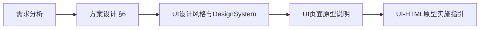

# AI 闯关学习小程序 — UI 设计文档索引

| 文档版本 | 日期 | 说明 |
| -------- | ---- | ---- |
| v1.1.0 | 2026-05-26 | 对齐 Bento 暖橙 HTML 原型（`bento-theme.css`） |
| v1.0.0 | 2026-05-26 | UI 设计文档产出计划验收索引 |

---

## 一、文档清单

| 文档 | 路径 | 内容摘要 |
| ---- | ---- | -------- |
| **设计风格与 Design System** | [UI设计风格与DesignSystem.md](./UI设计风格与DesignSystem.md) | 阿衰意境转译、市面参考、Token、吉祥物、组件、**混合文案对照表** |
| **页面原型说明** | [UI页面原型说明.md](./UI页面原型说明.md) | MVP 9 屏 + 扩展 11 屏线框、交互、路由、方案 §6 对照表 |
| **HTML 原型实施指引** | [UI-HTML原型实施指引.md](./UI-HTML原型实施指引.md) | gallery 结构、预览、验收 Checklist（HTML 阶段） |
| **HTML 原型迭代清单** | [UI-HTML原型迭代清单.md](./UI-HTML原型迭代清单.md) | 里程碑与资源清单（可选跟踪） |

**上游依据：**

- [交互式AI闯关学习微信小程序需求分析文档 (合并精简版).md](./交互式AI闯关学习微信小程序需求分析文档%20(合并精简版).md)
- [交互式AI闯关学习微信小程序方案设计文档.md](./交互式AI闯关学习微信小程序方案设计文档.md) — §6 前端页面与交互

**静态原型入口（实现对照，非本文档集范围）：**

- [`../prototypes/index.html`](../prototypes/index.html) — 总览六幕 showcase
- [`../prototypes/01_mvp_core.html`](../prototypes/01_mvp_core.html) — MVP 9 屏

---

## 二、已确认设计决策（10 项）

| # | 维度 | 决策 |
| --- | ---- | ---- |
| 1 | 视觉方向 | **Bento 暖橙**高保真 + 水彩横纹纸面；交互仍 Duolingo 单题闯关 |
| 2 | 文案 | **混合**：主流程温暖；Loading / 对错 / 结算可加漫画梗 |
| 3 | 字体 | 霞鹜文楷屏幕版（全局）+ 得意黑（仅解析/老师笔记区） |
| 4 | MVP 屏数 | **9 屏**（含独立结算 skeleton 态） |
| 5 | 吉祥物 | 设计规范保留小课豆；**当前 gallery 未挂载**，加载页用翻书动画 |
| 5b | 金币角标 | **原型已移除**顶栏金币数字；反馈条「+N 金币」文案可保留示意 |
| 6 | 正误色 | 文档漫画色；**实现** `#07c160` / `#fa5151` |
| 7 | 单题计时 | MVP **不做** |
| 8 | 生命值/灵韵 | MVP **不做** |
| 9 | 扩展页 | 02/03 共 11 屏，**中保真** |
| 10 | 502 失败页 | MVP 文档 **不包含**（实现 Toast + 回首页） |

---

## 三、MVP 明确不做项

| 项 | 文档位置 |
| -- | -------- |
| 单题倒计时 | [Design System §1.3](./UI设计风格与DesignSystem.md#13-交互骨架duolingo--刷题类借鉴)、[页面说明 §二](./UI页面原型说明.md#二mvp-核心闭环9-屏) |
| 生命值 / 灵韵 | 同上 |
| 登录 / 注册 | 屏 1「不做」列表 |
| 分享（可点击） | 屏 8 按钮置灰 |
| 502 独立失败页 | 屏 2 失败策略；无独立屏 |
| 复盘中心列表（持久化） | 扩展 R5；MVP 仅屏 8 内嵌短复盘 |
| 模式选择 / URL 解析 | 屏 1 |

---

## 四、阅读顺序建议

1. **Design System** — 定调 Token、吉祥物、文案
2. **页面原型说明** — 逐屏线框与状态机
3. **HTML 实施指引** — 需要对照静态 gallery 时阅读

---

## 五、文档阶段验收清单

| # | 标准 | 状态 |
| --- | ---- | ---- |
| 1 | 三份核心 UI 文档齐全，简体中文 | ✅ |
| 2 | MVP 9 屏与方案 §6.1–6.9 可对照 | ✅ 见 [页面说明 §二检查表](./UI页面原型说明.md#mvp-屏与方案对照检查表) |
| 3 | MVP 不做项已标注 | ✅ §三 |
| 4 | 市面参考 + 阿衰转译 + 混合文案 | ✅ [Design System §1.2、§2、§7.2](./UI设计风格与DesignSystem.md) |
| 5 | 需求/方案/UI 交叉引用 | ✅ |
| 6 | HTML 开发为独立阶段 | ✅ [实施指引 §一](./UI-HTML原型实施指引.md#一目标与边界) |

---

## 六、修订记录

| 版本 | 日期 | 说明 |
| ---- | ---- | ---- |
| v1.1.0 | 2026-05-26 | 对齐 `theme-bento` / `bento-theme.css`；翻书 Loading；无金币角标 |
| v1.0.0 | 2026-05-26 | 初版索引；对齐 UI 设计文档产出计划 |
