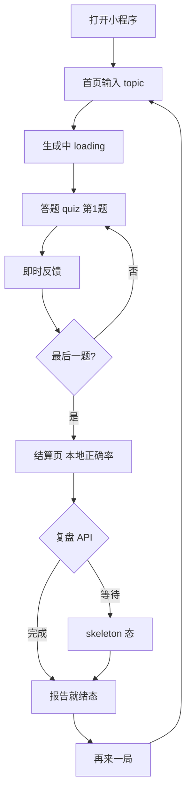
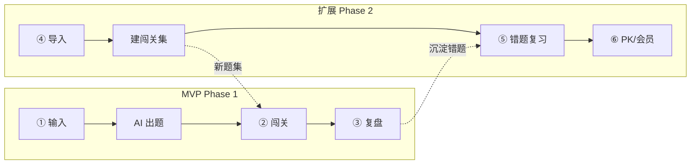

# 知练（KnowPractice）— UI 页面原型说明

> **产品品牌：** 知练（KnowPractice）。Tab「闯关」为导航文案，非对外品牌名。

| 文档版本 | 撰写时间 | 状态 |
| -------- | -------- | ---- |
| v1.6.0 | 2026-05-27 | 参考首页、Loading IP、反馈 demo；灵韵条原型与 MVP 不做项脚注 |
| v1.5.0 | 2026-05-26 | 悬浮胶囊底栏；底区纸纹连续；闯关首页图标 |
| v1.4.0 | 2026-05-26 | 布局顶对齐；无金币/XP；图标与克制进度条 |
| v1.3.0 | 2026-05-26 | 对齐 Bento 暖橙 HTML：`bt-*`、翻书 Loading、无金币角标 |
| v1.2.3 | 2026-05-26 | 总览六幕业务流程 showcase |
| v1.2.2 | 2026-05-26 | 总览三屏 showcase 布局 |
| v1.2.1 | 2026-05-26 | `ux-enhancements.css`：a11y / 触控 / 减少动效 |
| v1.1.0 | 2026-05-26 | 对齐 HTML 原型：笔记本风 + Bento 组件 |
| v1.0.0 | 2026-05-26 | 设计定稿（文档阶段） |

**相关文档：**

- [UI 设计文档索引](./UI设计文档索引.md)
- [UI 设计风格与 Design System](./UI设计风格与DesignSystem.md)
- [方案设计 §6 前端页面与交互](./交互式AI闯关学习微信小程序方案设计文档.md#六前端页面与交互设计)
- [需求分析 · 用户流程](./交互式AI闯关学习微信小程序需求分析文档%20(合并精简版).md#四-用户操作具体流程图)
- [UI HTML 原型实施指引](./UI-HTML原型实施指引.md)
- HTML 预览：[`../prototypes/index.html`](../prototypes/index.html)

---

## 〇、HTML 原型视觉层（v1.6 · Bento 暖橙）

静态 gallery 当前实现（见 [Design System §1.0.1](./UI设计风格与DesignSystem.md#101-当前-html-原型v14--bento-暖橙)）：

| 元素 | HTML 实现 |
| ---- | --------- |
| 主题 | `body.theme-bento` + `bento-theme.css` |
| 参考首页 | `ui.html` + `ui-ref-home.css`（`.ref-home`、热门横滑、compose 示例） |
| 横纹纸面 | `paper-lines-page.svg` / `paper-lines-screen.svg`（保留） |
| 组件 | `bt-*`（`bt-card`、`bt-opt`、`bt-tabbar` 等） |
| 解析 | `.bt-teacher-note`（得意黑；铅笔 SVG 标签） |
| Loading | `.bt-book-flip` + `loading-steps.js`；`mascots.svg#mascot-think` + 步骤气泡 |
| 答题反馈 | 屏 6/7：`quiz-feedback-demo.js` 视口内循环播放入场动效 |
| 灵韵（原型） | `.bt-spirit` 五段条（屏 3–7）；**产品 MVP 不做惩罚式生命值** |
| 顶栏 | 问候语 / 关闭 + 题号 pill；**无金币角标** |
| 底栏 | `bt-tabbar bt-tabbar-float`：机框内、`.phone-screen` 外；圆角胶囊；左右下留白；选中项蜜桃底 |
| 底区背景 | 有悬浮底栏时 `--bt-screen-paper-bg` 铺至整列 `phone-frame`，避免机框 `#FFFBF0` 条带 |

**CSS 引用顺序：** `shared.css` → `bento-theme.css`（屏① 另引 `ui-ref-home.css`）；生成页 `loading-steps.js`；屏 6/7 `quiz-feedback-demo.js`。

**归档（gallery 未引用）：** `graphic-note.css`、`ux-enhancements.css`。

**说明：** 线框结构仍以本章各屏「布局线框」为准；方格格纹、皮质书本外壳、顶栏金币 **不在** 当前原型范围内。

---

## 一、信息架构总览

### 1.1 MVP 路由（4 页 + 2 种 result 态）

| uni-app 路由 | 文档原型屏数 | 职责 |
| ------------ | ------------ | ---- |
| `pages/index/index` | 1 | 输入 topic |
| `pages/loading/loading` | 1 | 调 `POST /quiz/generate` |
| `pages/quiz/quiz` | 5（3 题型 + 2 反馈态） | 本地判分 ×10 |
| `pages/result/result` | 2（报告就绪 / skeleton） | 本地分 + `POST /quiz/report` |

### 1.2 扩展路由（Phase 2+，仅原型示意）

不在 MVP `pages.json` 中；本文档以 **中保真** 描述，供路线图评审。

### 1.3 核心用户流程



### 1.4 屏数统计

| 分组 | 屏数 | HTML 文件 |
| ---- | ---- | --------- |
| MVP 核心 | **9** | [`01_mvp_core.html`](../prototypes/01_mvp_core.html) |
| 扩展功能 | **6** | [`02_extended_features.html`](../prototypes/02_extended_features.html) |
| 报告与社交 | **5** | [`03_reports_social.html`](../prototypes/03_reports_social.html) |
| **合计** | **20** | + [`index.html`](../prototypes/index.html) 总览 |

### 1.5 六幕业务流程（总览 showcase）

| 幕 | 名称 | Phase | 用户目标 | 原型入口 |
| -- | ---- | ----- | -------- | -------- |
| 1 | 开始闯关 | MVP | 输入主题，生成题集 | `pages/index` → 01 屏① |
| 2 | 闯关答题 | MVP | 单题专注 + 即时对错 | `pages/quiz` → 01 屏③–⑦ |
| 3 | 复盘报告 | MVP | 掌握度 + 三句总结 + 薄弱点 | `pages/result` → 01 屏⑧–⑨ |
| 4 | 多源导入 | 扩展 | 文本/链接/文档/视频 → 闯关集 | 02 gallery |
| 5 | 复盘与错题 | 扩展 | 后台指标 + 复习计划 + 错题本 | 02 + 03 gallery |
| 6 | PK/排行/会员 | 扩展 | 对战、榜单、订阅权益 | 02 gallery |



总览页 [`index.html`](../prototypes/index.html) 以 **两行 × 三屏** 呈现上述六幕；`.biz-flow-map` 标注 API 与 Phase 分界。

---

## 二、MVP 核心闭环（9 屏）

> Mock 统一：topic =「TCP 三次握手」· 共 10 题 · 题型 `single` / `multiple` / `judge`

---

### 屏 1 · 首页 · 输入

| 项 | 内容 |
| -- | ---- |
| 路由 | `pages/index/index` |
| 目的 | 收集用户一句话学习主题 |
| 顶栏 | `bt-greeting`（连胜可选）；无金币 |

**布局线框（HTML v1.6 · `ref-home`）：**

```
┌─────────────────────────────────┐
│ 🔥连胜  你好，小皮                │  ref-top
│ 今天想闯哪一关？                  │  纯文案标题
│  ┌───────────────────────────┐  │
│  │ 占位 + 示例主题（compose）   │  │  ref-compose
│  └───────────────────────────┘  │
│  → 开始生成题目                  │  主 CTA + 箭头
│  热门主题 ←→ 横滑卡片 ×4         │  ref-topic-row
│  未完成关卡 · [继续]             │  ref-level-item
└─────────────────────────────────┘
  ┌───────────────────────────────┐
  │ 🏠闯关  题库  勋章            │  bt-tabbar-float
  └───────────────────────────────┘
```

> 线框类名 `bt-input-card` / `bt-topic-grid` 仍可用于 uni-app 组件命名；当前 gallery 屏① 以 `ref-*` 实现为准，并与 [`ui.html`](../prototypes/ui.html) 同步。

| 元素 | 规格 |
| ---- | ---- |
| 输入 | 多行 `textarea`，最少 2 字校验（实现层） |
| 主按钮 | 全宽；跳转 `loading` 并传 topic |
| 不做 | 模式选择、URL 解析、登录 |

**文案（混合·温暖为主）：** 见 [Design System §7](./UI设计风格与DesignSystem.md#七文案规范混合语气)

---

### 屏 2 · AI 生成中

| 项 | 内容 |
| -- | ---- |
| 路由 | `pages/loading/loading` |
| API | `POST /api/v1/quiz/generate`，timeout 60s |
| 主视觉 | `.bt-book-flip` + `mascots.svg#mascot-think`（步骤气泡由 `loading-steps.js` 驱动） |

**布局线框：**

```
┌─────────────────────────────────┐
│ AI 正在出题…                     │
│  [IP 气泡]  等等，我去翻翻笔记…    │
│  ┌───────────────────────────┐  │
│  │      [翻书动画]            │  │
│  │  ████████████░░░░          │  │  bt-progress-line
│  │  ④ 准备进入闯关…           │  │  data-gen-sub
│  └───────────────────────────┘  │
│  ①检索 ②出题 ③排版 ④准备        │  bt-stepper（当前高亮/完成勾）
│         [ 取消 ]                │
└─────────────────────────────────┘
```

| 行为 | 说明 |
| ---- | ---- |
| 进度 | 0–5s 快速至 ~40%，之后缓增至 ~90%，成功瞬间 100% |
| 成功 | 写入 `currentQuiz`，跳转 `quiz` |
| 失败 | 文档阶段不单独建 502 屏；实现时 Toast + 回首页 |

---

### 屏 3 · 答题 · 单选 `single`

| 项 | 内容 |
| -- | ---- |
| 路由 | `pages/quiz/quiz` |
| 顶栏 | 关闭 + `第 n / m 题` pill（无金币） |
| 计时 | **无** |

**布局线框：**

```
┌─────────────────────────────────┐
│ [×]      第 3 / 10 题            │  bt-quiz-header
│ TCP 三次握手            [单选]   │
│ ████████░░░░                     │
│ 题干…                            │  bt-q-stem
│  (A) …  (B) …                   │  bt-opt 渐变
│              [ 固定底栏空 ]      │
└─────────────────────────────────┘
```

| 交互 | 点选一项 → 本地判分 → 展示屏 6 或 7 状态（同页切换） |

---

### 屏 3′ · 答题 · 退出确认 `exit-sheet`

| 项 | 内容 |
| -- | ---- |
| 路由 | `pages/quiz/quiz`（态：退出 Sheet 打开） |
| 触发 | 顶栏 ✕ 关闭；系统返回（实现层拦截） |
| 组件 | `.bt-exit-layer` + `.bt-scrim` + `.bt-sheet` |

**布局线框：**

```
┌─────────────────────────────────┐
│      第 3 / 10 题          [×]  │
│  （题干区被遮罩压暗）             │
├─────────────────────────────────┤
│  ░░░░░░░ 遮罩 48% ░░░░░░░░░░░░░ │
│  ┌───────────────────────────┐  │
│  │      ─── 拖拽条 ───        │  │
│  │      要先离开吗？          │  │
│  │  已完成 2/10 题，下次从     │  │
│  │  第 3 题继续               │  │
│  │  ████░░░░ 进度条           │  │
│  │  [ 继续答题 ]  主按钮       │  │
│  │  [ 保存并退出 ] 次按钮      │  │
│  │      放弃本关              │  │
│  └───────────────────────────┘  │
└─────────────────────────────────┘
```

| 行为 | 说明 |
| ---- | ---- |
| 继续答题 | 关闭 Sheet，留在当前题 |
| 保存并退出 | 写入 `quizProgress` / `quizAnswers` → 回首页；未完成关卡大卡可续玩 |
| 放弃本关 | 清除 `currentQuiz` 等 3 个 key → 回首页 |
| 点遮罩 | 等同「继续答题」 |

HTML 画廊：`01_mvp_core.html` 屏 **③′**。

---

### 屏 4 · 答题 · 多选 `multiple`

| 项 | 内容 |
| -- | ---- |
| 顶栏标签 | `[多选]` |
| 差异 | 可多选；底部 **「确认提交」**；未选时按钮 disabled |

**布局线框（底栏）：**

```
│  (A)(B) 已选高亮 selected        │
│  ┌───────────────────────────┐  │
│  │      确认提交              │  │
│  └───────────────────────────┘  │
```

判分：选项集合与 `answer[]` 完全一致（方案 §6.5）。

---

### 屏 5 · 答题 · 判断 `judge`

| 项 | 内容 |
| -- | ---- |
| 顶栏标签 | `[判断]` |
| 选项 | 仅两个大按钮：「正确」「错误」 |

**Mock 示例：**

- 题干：「TCP 使用四次握手建立连接」
- 用户应选：**错误**（`answer: 1`，选项下标语义）

---

### 屏 6 · 即时反馈 · 答对

| 项 | 内容 |
| -- | ---- |
| 态 | `quiz` 页内状态，非新路由 |
| 组件 | `bt-meta-row`（题目标签 + 题型）+ `bt-progress-line`；`bt-feedback-bar` + `bt-teacher-note` |
| 动效 | gallery：`data-feedback-demo` + `quiz-feedback-demo.js`（入场 + 视口内循环） |
| 色 | `bt-opt.is-correct` / 实现 `#07c160` |
| 音效 | 短促「叮」— MVP 必做 |

**布局线框：**

```
│  (B) ACK  ✓  绿底渐变              │
│  ┌ 答对啦 ────────────────────┐  │  bt-feedback-bar（无金币文案）
│  ┌ 老师笔记 ─────────────────┐  │  bt-teacher-note
│  │ 解析正文…                  │  │
│  └───────────────────────────┘  │
│  [ 上一题 ]  [ 继续 → ]          │  bt-btn-row
```

末题按钮文案改为 **「查看报告」**。

---

### 屏 7 · 即时反馈 · 答错

| 项 | 内容 |
| -- | ---- |
| 动效 | 容器 shake + `uni.vibrateShort()`（实现层）；gallery 同屏 6 反馈 demo |
| 色 | `bt-opt` 错态 / 实现 `#fa5151` |
| 原型 | 顶栏 `.bt-spirit--2` 低余量脉冲（**非产品 MVP 必做**） |

**布局线框：**

```
│  所选项 红底  ✗                    │
│      ┌──「啊哦…」──┐               │
│  ┌─ speech-bubble.wrong ─────────┐ │
│  │ 错了也学到！正确答案是 B…     │ │
│  └─────────────────────────────┘  │
│  ┌───────────────────────────┐  │
│  │      继续下一题              │  │
│  └───────────────────────────┘  │
```

每题结束：追加 `quizAnswers`，更新 `quizProgress`（方案 §6.4）。

---

### 屏 8 · 结算 · 报告就绪

| 项 | 内容 |
| -- | ---- |
| 路由 | `pages/result/result` |
| 吉祥物 | `mascot--happy` |
| 数据 | 本地 `score` / `correct_rate` 立即可见 |

**布局线框：**

```
┌─────────────────────────────────┐
│  ┌──── 通关！ ────┐  pass-banner │
│      TCP 三次握手                 │
│         ( 7/10 )                 │
│        ╭───────╮                 │
│        │  70%  │  score-ring    │
│        ╰───────╯                 │
│  ┌─ report-section ───────────┐  │
│  │ ## AI 复盘                 │  │
│  │ - 掌握不错…                │  │  Markdown 已渲染
│  │ - 建议复习 TIME_WAIT       │  │
│  └────────────────────────────┘  │
│  ┌───────────────────────────┐  │
│  │      再来一局              │  │
│  └───────────────────────────┘  │
│  [ 分享给好友 ]  disabled         │
└─────────────────────────────────┘
```

**与屏 9 关系：** 本态 **不** 在报告底部再嵌 skeleton 条；与 skeleton 态拆成两屏展示。

---

### 屏 9 · 结算 · 复盘生成中（skeleton）

| 项 | 内容 |
| -- | ---- |
| 路由 | 同 `result`，**UI 态**不同 |
| 触发 | 进入 result 后立即；`POST /quiz/report` 进行中 |
| 吉祥物 | `mascot--cheer` 或 `mascot--think` |

**布局线框：**

```
┌─────────────────────────────────┐
│  （分数环与 7/10 已与屏8相同）    │
│  ┌─ report-section ───────────┐  │
│  │ ░░░░░░░░░░░░░░░░░░        │  │  skeleton-line ×3
│  │ ░░░░░░░░░░                │  │
│  │ AI 正在生成复盘报告…       │  │
│  └────────────────────────────┘  │
│  （主按钮可隐藏或 loading 禁用）   │
└─────────────────────────────────┘
```

API 返回后：同页切换至屏 8 内容（或刷新 `report` 区域）。

---

### MVP 屏与方案对照检查表

| 检查项 | 屏 | 通过标准 |
| ------ | -- | -------- |
| 仅单一输入 | 1 | 无模式/URL 入口 |
| 心理学进度 | 2 | 文案轮播 + 可取消 |
| 三题型 | 3–5 | single/multiple/judge UI 可分 |
| 多选确认提交 | 4 | 无自动跳题 |
| 判断题语义 | 5 | Mock 体现 answer 为下标 |
| 绿/红+震动+音效 | 6–7 | 方案 §6.3 |
| 即时解析 | 6–7 | `explanation` 气泡 |
| 无计时 | 3–7 | 顶栏无倒计时 |
| 无生命值 | 3–7 | uni-app **不做** hearts/灵韵惩罚；gallery 可有 `.bt-spirit` 仅视觉探索 |
| result 二次等待 | 9 | skeleton 独立描述 |
| 再来一局清 3 key | 8 | 不 `clearStorage` |
| 分享 MVP 不做 | 8 | 置灰 |

---

## 三、扩展功能（6 屏 · 中保真）

> 优先级见需求分析 P1–P3；**均非 MVP**。

| # | 屏名 | 优先级 | 目的 | 核心元素 |
| --- | ---- | ------ | ---- | -------- |
| E1 | RAG 知识库 | P1 | 上传资料出题 | 文件/upload 区、知识库标签、生成按钮 |
| E2 | VIP 充值 | P2 | 商业化 | 套餐卡 ×3、价格、权益列表 |
| E3 | AI 生图题目 | P2 | 视觉记忆 | 题干配图开关、单词卡示例 |
| E4 | 多人 PK | P3 | 社交对战 | 房间号、匹配中、对手头像 |
| E5 | 排行榜 | P3 | 攀比激励 |  podium 前三 + 列表 |
| E6 | 语音 / 数字人 | P3 | 多元互动 | 读题按钮、数字人预览框 |

**统一要求：**

- 角落 `mascot-chip` 情绪匹配场景
- 角标水印「非 MVP」或 Phase 标签
- 不出现惩罚式生命值/灵韵（产品已确认 MVP 不做）；扩展屏亦勿暗示扣心

---

### E1 · RAG 知识库（线框摘要）

```
┌─────────────────────────────────┐
│ 上传 PDF / 粘贴文本              │
│ [ 选择文件 ]  [ 我的知识库 ▼ ]   │
│  ┌─ 企业培训规章.pdf ─────────┐  │
│  └────────────────────────────┘  │
│  [ 从知识库生成题目 ]            │
└─────────────────────────────────┘
```

---

### E2 · VIP 充值（线框摘要）

```
│  月度 / 季度 / 年度 套餐卡横向滑动 │
│  权益：无限生成 · 优先队列 · …    │
│  [ 立即开通 ]                    │
```

---

### E3 · AI 生图（线框摘要）

```
│  [✓] 为本套题生成配图              │
│  ┌────┐  apple  图片占位          │
│  └────┘                          │
```

---

### E4–E6

详见扩展路线图；PK/排行/语音仅保留主按钮与状态文案，数据 Mock 即可。

---

## 四、报告与社交（5 屏 · 中保真）

| # | 屏名 | Phase | 目的 |
| --- | ---- | ----- | ---- |
| R1 | 复盘报告详情 | 2b | 长文 Markdown 阅读 |
| R2 | 知识图谱 | 2b | 知识点节点关系示意 |
| R3 | 薄弱点分析 | 2b | 五维雷达 / 条形图 |
| R4 | 战绩海报 | 3 | 9:16 分享图预览 |
| R5 | 错题本 | 2b | 错题列表 + 详情 |

**说明：**

- MVP 仅在屏 8 内嵌短复盘；R1 为独立「历史报告」深化
- R4 分享按钮在 MVP 置灰；海报屏标 Phase 3
- R5 对应需求「复盘中心」— 方案 MVP 不做持久化

---

### R1 · 复盘详情（线框摘要）

```
│  ← 返回    TCP 三次握手  2026-05-26 │
│  ┌─ 长文 Markdown ─────────────┐  │
│  │ ### 掌握情况                 │  │
│  │ …                           │  │
│  └─────────────────────────────┘  │
```

---

### R3 · 薄弱点（线框摘要）

```
│        掌握度雷达图（SVG）         │
│  握手顺序 ████████░░ 80%          │
│  断开连接 ████░░░░░░ 40%          │
```

---

## 五、页面跳转矩阵

| 从 \ 到 | index | loading | quiz | result |
| ------- | ----- | ------- | ---- | ------ |
| index | — | 开始学习 | — | — |
| loading | 取消 | — | generate 成功 | — |
| quiz | 保存并退出 | — | 下一题/自循环 | 末题→result |
| result | 再来一局 | — | — | — |

扩展屏均应从「个人中心」或设置入口进入（未来）；本文档不定义 MVP 入口。

---

## 六、Storage 与 UI 关系（实现参考）

| Key | 影响的 UI |
| --- | --------- |
| `currentQuiz` | 题干、选项、题型标签 |
| `quizProgress` | 顶栏 `N/10`、进度条 |
| `quizAnswers` | 结算分数环；report 请求体 |

`quiz` 页 `onShow`：从 storage 恢复题号，防误触返回丢进度。

---

## 七、修订记录

| 版本 | 日期 | 说明 |
| ---- | ---- | ---- |
| v1.5.0 | 2026-05-26 | 悬浮胶囊底栏；底区纸纹连续；闯关 Tab 首页图标 |
| v1.4.0 | 2026-05-26 | 布局顶对齐；无金币/XP；图标与克制进度条 |
| v1.3.0 | 2026-05-26 | 对齐 Bento 暖橙 HTML：`bt-*`、翻书 Loading、无金币角标 |
| v1.2.3 | 2026-05-26 | 总览六幕业务流程 + 双 Phase 业务地图 |
| v1.2.2 | 2026-05-26 | 总览页改为三屏横排 showcase（对齐参考 Bento 布局） |
| v1.2.1 | 2026-05-26 | §〇 补充 `ux-enhancements.css` 与引用顺序 |
| v1.1.0 | 2026-05-26 | 增加 §〇 HTML 视觉层；链到已落盘 gallery；笔记本不规则横纹 |
| v1.0.0 | 2026-05-26 | 初版：MVP 9 屏 + 扩展 11 屏线框与交互 |
