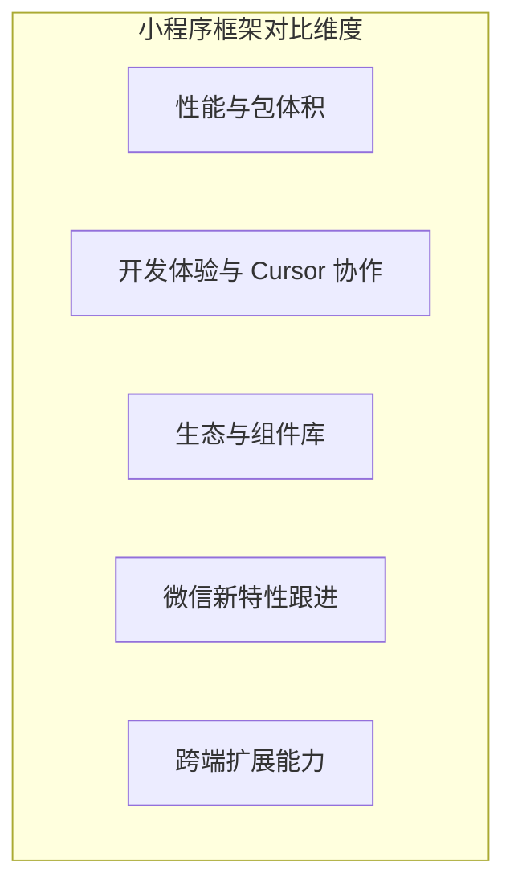
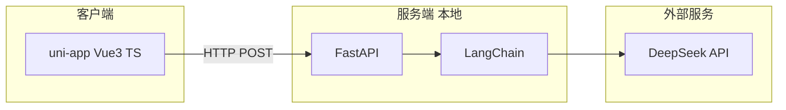
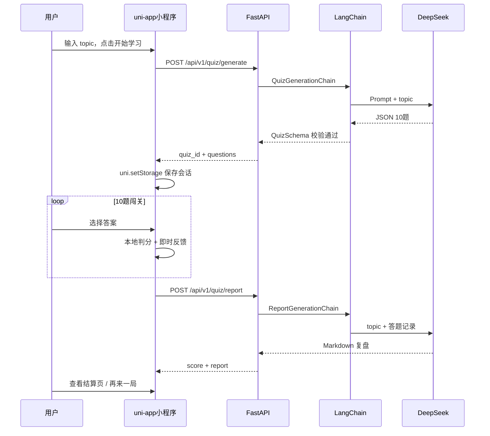
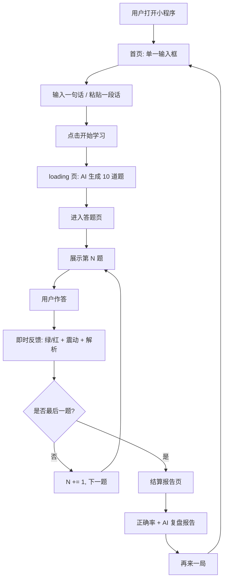
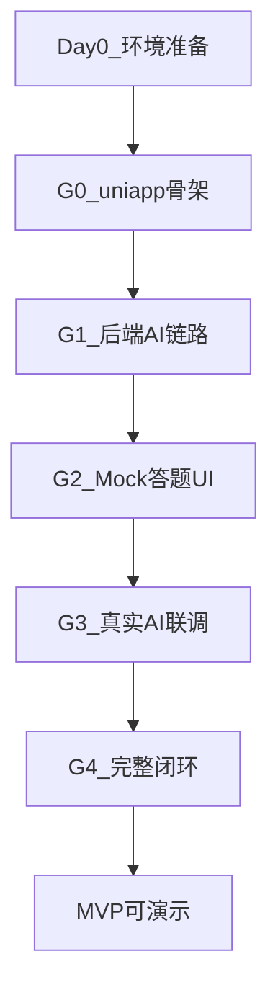

# 交互式 AI 闯关学习微信小程序 — 方案设计文档

| 文档版本 | 撰写时间   | 依据文档                                                     | 状态   |
| -------- | ---------- | ------------------------------------------------------------ | ------ |
| v1.3.0   | 2026-05-25 | [需求分析文档 (合并精简版)](./交互式AI闯关学习微信小程序需求分析文档%20(合并精简版).md) | 修订稿 |

**v1.3.0 修订说明：** 前端选型由 Taro+React 切换为 **uni-app + Vue 3 + TypeScript + Vite CLI**（不用 HBuilderX）；新增 **§七 核心 MVP 开发流程**（Daily Loop、G0–G4 验收闸门）；全文 API/示例/目录结构同步为 uni-app 语境。

**v1.2.0 修订说明：** 方案自检修订——统一 API 字段命名策略、towxml 集成、result 页二次 AI 等待 UX、三 key 会话存储、DeepSeek base_url 修正、超时与 OutputFixingParser 冲突应对。

**v1.1.0 修订说明：** 补充 Markdown 渲染选型（towxml）、Loading 心理学进度条、多选题集合判分、答题页 scroll-view 布局、「再来一局」精准清缓存等独立开发者实践经验。

---

## 一、项目概述

### 1.1 项目背景

泛知识时代，用户面对长篇推文、报告或学习资料时，被动阅读易疲劳，且缺乏即时反馈——「收藏从未停止，阅读从未开始」。本项目以**以测代学**为核心理念：用户输入一句想学的知识，AI 自动生成交互式闯关题目，用户在答题中获得即时反馈，通关后获得 AI 复盘报告，从而更轻松地掌握任意知识。

### 1.2 MVP 目标

MVP 阶段的最高原则是**路径最短**，仅保留单兵作战的极简体验，确保产品能一口气跑通核心闭环：

```
用户输入一句话 → AI 生成 10 道题 → 用户答题闯关 → AI 生成复盘报告
```

**MVP 成功标准：**

- 本地环境可完整跑通上述闭环
- 10 道题支持 AI 自动搭配的多种题型（单选 / 多选 / 判断）
- 每题答完即时反馈（绿/红 + 震动 + 解析）
- 结算页展示正确率与 AI 复盘报告
- Prompt 与交互体验经内测验证可用

### 1.3 MVP 约束与边界

以下为人工确认的技术与功能边界，开发时必须遵守：

| 维度     | MVP 决策                                                     |
| -------- | ------------------------------------------------------------ |
| 前端     | **uni-app + Vue 3 + TypeScript + Vite CLI**（不用 HBuilderX） |
| 后端     | Python FastAPI + LangChain + DeepSeek API                    |
| 知识来源 | **纯 LLM 出题**（模型自主补充知识）；外部检索 / RAG 延至 Phase 2 |
| 部署     | **暂不考虑**；本地开发 + 微信开发者工具体验版内测            |
| 小程序主体 | 个人主体；体验版内测，暂不上架「深度合成-AI 问答」类目     |
| 题量     | 固定 **10 题**                                               |
| 题型     | **AI 自动搭配**（`single` / `multiple` / `judge`；MVP 不含填空） |
| 存储     | 无数据库；会话数据用 `uni.setStorage` 临时持有               |
| 明确不做 | 登录注册、复盘中心页、msgSecCheck、题目缓存、分享海报、生产部署 |

### 1.4 与需求分析文档的差异说明

本方案在需求分析文档基础上，经人工讨论做了如下调整，**以本方案为准**：

| 需求分析文档描述                     | 本方案调整                               | 原因                                   |
| ------------------------------------ | ---------------------------------------- | -------------------------------------- |
| AI 从全网检索知识再出题              | MVP 暂缓检索，纯 LLM 基于 topic 自主出题 | 缩短后端链路，优先跑通闭环             |
| 流程图含「后台录入答题情况及错题」   | MVP 不做持久化存储与复盘中心页           | 避免数据库依赖，聚焦核心流程           |
| 复盘中心模块（错题本 / 答题分析列表） | MVP 仅保留结算页内嵌 AI 复盘报告         | 同上                                   |
| 题型未明确                           | 固定 10 题，题型由 AI 在 3 种类型中搭配  | 提升趣味性，前端需兼容多题型 UI        |
| msgSecCheck 内容合规                 | MVP 暂缓                                 | 需求文档 todo：暂时先不用              |
| 题目缓存复用                         | MVP 暂缓，每次实时生成                   | 需求文档 todo：暂时先不用              |
| 分享好友                             | MVP 暂缓                                 | 非核心闭环                             |
| 后端数据存储 CRUD                    | MVP 不做                                 | 用户明确要求先不做数据库               |

### 1.5 选型变更记录（v1.3.0）

| 版本   | 前端选型              | 变更原因                                           |
| ------ | --------------------- | -------------------------------------------------- |
| v1.0–1.2 | Taro 4 + React + TS | 初版方案                                           |
| v1.3.0 | **uni-app + Vue3 + TS** | 纯 CLI 下微信小程序坑更少；towxml 集成更简单；Vue SFC 与 Cursor 协作良好 |

---

## 二、技术选型

### 2.1 小程序前端框架对比

微信小程序开发框架迭代快，本项目只做微信端 MVP，但需兼顾 Cursor 协作效率与未来跨端可能。以下为三种主流方案对比：



| 对比维度       | 原生 + TypeScript        | Taro 4 + React           | uni-app + Vue 3          |
| -------------- | ------------------------ | ------------------------ | ------------------------ |
| **性能**       | 最优，首屏渲染最快       | 良好，运行时层有损耗     | 良好，编译产物接近原生   |
| **包体积**     | 最小                     | 增加约 30–50%            | 增加约 30–50%            |
| **纯 CLI 坑少** | 中（需学 WXML）          | 较多（React 桥接原生组件） | **较少（编译时方案）**   |
| **IDE 绑定**   | 微信开发者工具           | 无需 HBuilderX           | **无需 HBuilderX**       |
| **Cursor 协作** | 良好                     | 良好（React/TSX）        | 良好（Vue SFC）          |
| **towxml 集成** | 原生最简单               | 桥接成本高（1–2 天）     | **相对简单**             |
| **跨端能力**   | 仅微信                   | 微信 / H5 / 其他小程序   | 微信 / 多端 / App        |
| **组件生态**   | WeUI、Vant Weapp         | TDesign、NutUI           | uView、uni-ui            |
| **适用场景**   | 单端极致性能             | React 团队               | **Vue 团队 / 快速 MVP**  |

**Skyline 渲染引擎说明（2025–2026 微信官方重点）：**

- Skyline 基于 WebGL + glass-easel，setData 通信开销更低
- uni-app 可在 `manifest.json` 中配置 Skyline，低版本自动回退 WebView
- MVP 阶段真机验证后再决定是否默认开启

### 2.2 前端选型结论：uni-app + Vue 3 + TypeScript + Vite CLI

**选定理由（v1.3.0）：**

1. **纯 CLI 开发**，无需安装 HBuilderX；Cursor + 终端 + 微信开发者工具即可
2. **编译时方案**，Vue 模板与小程序模板接近，微信小程序端坑相对 Taro React 更少
3. **towxml** 等原生自定义组件集成比 Taro React 桥接简单
4. 未来若需支付宝/H5 等多端，uni-app 条件编译成熟
5. uView / uni-ui 等组件库可加速 MVP UI

**uni-app 日常开发工作流（不用 HBuilderX）：**

```bash
# 首次：在 AI-Learn/ 目录
npx degit dcloudio/uni-preset-vue#vite-ts uniapp
cd uniapp && npm install

# 日常开发
npm run dev:mp-weixin

# 微信开发者工具 → 导入编译产物目录（常见路径，以终端日志为准）：
#   uniapp/dist/dev/mp-weixin
# 详情 → 本地设置 → 勾选「不校验合法域名、web-view...」
```

### 2.3 前端 Markdown 渲染选型

结算页需渲染 AI 生成的 Markdown 复盘报告。**禁止使用** `marked` 转 HTML 再塞给微信原生 `rich-text` 组件——样式极易错乱。

**MVP 明确选型：towxml**

| 方案 | 说明 | 本方案决策 |
| ---- | ---- | ---------- |
| `rich-text` + `marked` | 自行转 HTML | ❌ 禁止 |
| **towxml** | 微信生态成熟的 Markdown/WXML 渲染库 | ✅ **首选** |
| 备选方案 B | Markdown 按段落用 `<view>` 渲染 | ✅ Sprint 4 降级备选 |

**uni-app 集成 towxml（Sprint 4）：**

```bash
cd uniapp && npm install towxml
# 将 towxml 复制到 uniapp/src/components/towxml/ 或通过 uni_modules 引入
```

1. 在 **result 页** `pages.json` 或页面级配置中声明 `usingComponents`
2. 在 `ReportView.vue` 中调用 towxml 解析 API，将 Markdown 转为 nodes 数据绑定渲染
3. 复盘 Prompt 避免复杂表格，以标题、列表、加粗为主
4. 若集成超过 2 天，启用**备选方案 B**：按 `\n\n` 分段 + 简单样式，不阻塞 G4 验收

> 相较 Taro React，uni-app 使用原生自定义组件路径更直接，Sprint 4 建议预留 **0.5–1 天**（非 1–2 天）。

### 2.4 后端技术选型

| 组件       | 选型              | 理由                                           |
| ---------- | ----------------- | ---------------------------------------------- |
| Web 框架   | **FastAPI**       | 异步支持、Pydantic 类型校验、自动生成 OpenAPI 文档 |
| AI 编排    | **LangChain**     | Prompt 模板化、结构化 JSON 输出、后续 RAG/Agent 扩展 |
| 大模型     | **DeepSeek API**  | OpenAI 兼容协议，性价比高；Key 仅放服务端      |
| 数据存储   | **无**（MVP）     | 会话级临时存储，Phase 2 再引入云数据库         |
| 部署       | **本地 uvicorn**  | MVP 暂不考虑生产部署                           |

**DeepSeek 接入方式：**

```python
from langchain_openai import ChatOpenAI

llm = ChatOpenAI(
    model="deepseek-chat",
    api_key=settings.DEEPSEEK_API_KEY,
    base_url="https://api.deepseek.com/v1",  # 必须带 /v1
    temperature=0.7,
)
```

### 2.5 技术栈总览



---

## 三、系统架构

### 3.1 整体架构

系统采用**前后端分离 + 本地 Monorepo** 结构。小程序通过 `uni.request` 调用本地 FastAPI；AI 能力由 LangChain 编排后调用 DeepSeek；判分在前端本地完成。



### 3.2 核心业务流（MVP 精简版）



### 3.3 项目目录结构（Monorepo）

```
AI-Learn/
├── uniapp/                     # uni-app + Vue 3 + TypeScript + Vite
│   ├── src/
│   │   ├── pages/
│   │   │   ├── index/index.vue       # 首页：输入框 + 开始学习
│   │   │   ├── loading/loading.vue   # 生成中：心理学进度条
│   │   │   ├── quiz/quiz.vue         # 答题闯关
│   │   │   └── result/result.vue     # 结算报告
│   │   ├── components/
│   │   │   ├── QuestionCard.vue
│   │   │   ├── OptionList.vue
│   │   │   ├── FeedbackPanel.vue
│   │   │   └── ReportView.vue        # towxml 渲染
│   │   ├── services/
│   │   │   └── api.ts                # 封装 uni.request
│   │   ├── utils/
│   │   │   ├── scoring.ts
│   │   │   └── storage.ts            # currentQuiz / quizAnswers / quizProgress
│   │   └── types/
│   │       └── quiz.ts
│   ├── pages.json              # 页面路由、usingComponents
│   ├── manifest.json           # 小程序 AppID、Skyline 等
│   ├── vite.config.ts
│   ├── package.json
│   └── tsconfig.json
├── backend/                    # Python FastAPI（Sprint 1 创建）
│   ├── app/
│   │   ├── main.py
│   │   ├── config.py
│   │   ├── routers/quiz.py
│   │   ├── chains/
│   │   ├── schemas/quiz.py
│   │   └── prompts/
│   ├── tests/
│   ├── requirements.txt
│   └── .env.example
├── docs/
└── README.md                   # Monorepo 启动说明（开发阶段补充）
```

---

## 四、LangChain 链路设计

### 4.1 设计原则

| 模块                         | MVP 是否使用 | 说明                           |
| ---------------------------- | ------------ | ------------------------------ |
| `ChatOpenAI`（DeepSeek）     | ✅           | 大模型调用                     |
| `ChatPromptTemplate`         | ✅           | Prompt 版本化管理              |
| `PydanticOutputParser`       | ✅           | 强制 JSON 结构输出             |
| `OutputFixingParser`         | ✅           | JSON 解析失败时自动修复重试    |
| Tavily / Retriever           | ❌           | Phase 2 检索                   |
| LangGraph / Multi-Agent      | ❌           | Phase 2                        |
| Memory / Vector DB           | ❌           | Phase 2 RAG                    |

### 4.2 Chain 1：出题 `QuizGenerationChain`

**输入：** `{ topic: string }`  
**输出：** `{ quiz_id, topic, questions[10] }`

**JSON 解析失败重试策略：**

1. `PydanticOutputParser` 校验
2. 失败则 `OutputFixingParser` 修复，**最多 1 次**
3. 仍失败返回 HTTP 502

**⚠️ 超时与重试冲突（MVP 必须处理）：**

| 约束 | 数值 |
| ---- | ---- |
| 单次 LLM 调用 | 通常 15–30s |
| OutputFixingParser 重试 | 再加 15–30s |
| 前端 `uni.request` timeout | 60s（微信硬上限） |

**MVP 应对策略：**

1. Prompt 强约束 + JSON mode（若 DeepSeek 支持），降低 fix 触发率
2. 单次 LLM `timeout=25s`，整请求 `timeout=55s`
3. Fix 失败直接 502，由用户重试（优于 504）

### 4.3 Chain 2：复盘 `ReportGenerationChain`

**输入：** `{ topic, questions[], answers[] }`  
**输出：** Markdown 复盘报告

### 4.4 数据契约（前后端共享）

### 4.5 API 字段命名策略（⚠️ 联调前必须统一）

**MVP 决策：HTTP JSON 层统一 snake_case，前端 TypeScript 类型与 API 对齐，不做 camelCase 转换。**

| 层 | 命名 | 示例 |
| --- | --- | --- |
| Python / HTTP JSON | snake_case | `quiz_id`, `correct_rate` |
| TypeScript 类型 | snake_case | 与 API 一致 |

**TypeScript（`uniapp/src/types/quiz.ts`）：**

```typescript
export type QuestionType = 'single' | 'multiple' | 'judge'

export interface Question {
  id: string
  type: QuestionType
  stem: string
  options?: string[]
  answer: number | number[]
  explanation: string
}

export interface QuizSession {
  quiz_id: string
  topic: string
  questions: Question[]
}

export interface UserAnswer {
  question_id: string
  selected: number | number[]
  correct: boolean
}

export interface GenerateQuizResponse {
  quiz_id: string
  topic: string
  questions: Question[]
}

export interface ReportResponse {
  score: number
  total: number
  correct_rate: number
  report: string
}
```

**Python Schema** 含 `@model_validator` 按题型校验 answer/options（见 v1.2.0 §4.4，结构不变）。

---

## 五、API 设计

### 5.1 接口一览

| 接口                      | 方法 | 说明               | 建议超时 |
| ------------------------- | ---- | ------------------ | -------- |
| `/health`                 | GET  | 健康检查           | —        |
| `/api/v1/quiz/generate`   | POST | 根据 topic 生成 10 题 | 60s   |
| `/api/v1/quiz/report`     | POST | 根据答题记录生成复盘 | 30s   |

**Base URL（本地开发）：** `http://127.0.0.1:8000`

### 5.2–5.3 请求/响应

与 v1.2.0 相同（snake_case JSON），详见原文档示例。

### 5.4 跨域与安全

- 微信开发者工具勾选「不校验合法域名」
- DeepSeek Key 仅存 `backend/.env`
- **`uni.request` 不走浏览器 CORS**；FastAPI CORS 仅 H5 调试需要

**`.env.example`：**

```env
DEEPSEEK_API_KEY=sk-xxxxxxxx
DEEPSEEK_MODEL=deepseek-chat
DEEPSEEK_BASE_URL=https://api.deepseek.com/v1
LLM_CALL_TIMEOUT=25
REQUEST_TOTAL_TIMEOUT=55
```

---

## 六、前端页面与交互设计

### 6.1 页面结构

| 页面   | 路由                         | 职责                               | 关键组件                    |
| ------ | ---------------------------- | ---------------------------------- | --------------------------- |
| 首页   | `pages/index/index`          | textarea +「开始学习」             | 输入校验                    |
| 生成页 | `pages/loading/loading`      | 心理学进度条 + 文案轮播            | ProgressBar、TipCarousel    |
| 答题页 | `pages/quiz/quiz`            | 单题闯关 1/10                      | QuestionCard、OptionList    |
| 结算页 | `pages/result/result`        | 正确率 + AI 复盘 +「再来一局」     | ScoreRing、ReportView       |

**跳转关系：**

```
index → loading → quiz → result → index（再来一局）
```

### 6.2 题型 UI 策略

| 题型       | UI 行为                    | 判分逻辑                         |
| ---------- | -------------------------- | -------------------------------- |
| `single`   | 4 选项，点选锁定           | `selected === answer`            |
| `multiple` | 多选 +「确认提交」         | 集合相等（§6.5）                 |
| `judge`    | 「正确」「错误」两按钮     | `selected === answer`（选项下标）|

**判断题语义：** `answer` 是正确**选项**的下标。题干「TCP 使用四次握手」应选「错误」→ `answer: 1`。

### 6.3 交互动效（需求强制）

| 场景 | 行为 |
| ---- | ---- |
| 答对 | 选项变绿 `#07c160` + **短音效（MVP 必做）** |
| 答错 | 选项变红 `#fa5151` + `uni.vibrateShort()` |
| 解析 | 答题后立即展示 `explanation` |
| 下一题 | 最后一题按钮变为「查看报告」 |

### 6.4 状态管理（Vue 3 Composition API）

MVP 不引入 Pinia，采用 **ref/reactive + uni.storage**：

| 数据     | 存储方式 |
| -------- | -------- |
| 题目会话 | `uni.setStorageSync('currentQuiz', QuizSession)` |
| 答题记录 | `uni.setStorageSync('quizAnswers', UserAnswer[])` — 每答一题追加 |
| 当前题号 | `ref` + 同步 `uni.setStorageSync('quizProgress', { index })` |
| 页面传参 | **禁止** URL 传题目 JSON；统一 storage |

**Storage Key 一览：**

| Key | 内容 | 清除时机 |
| --- | --- | --- |
| `currentQuiz` | 题目 + topic | 再来一局 |
| `quizAnswers` | 答题记录 | 再来一局 |
| `quizProgress` | 当前题号 | 再来一局 |

> **⚠️ 禁止 `uni.clearStorage()`。**「再来一局」仅删除上述 3 个 key：
> ```typescript
> uni.removeStorageSync('currentQuiz')
> uni.removeStorageSync('quizAnswers')
> uni.removeStorageSync('quizProgress')
> ```

> **⚠️ 不可仅依赖组件内 ref**——误触返回会丢进度。quiz 页 `onShow` 时从 storage 恢复。

### 6.5 本地判分逻辑

```typescript
// uniapp/src/utils/scoring.ts

function isMultipleChoiceCorrect(selected: number[], answer: number[]): boolean {
  if (selected.length !== answer.length) return false
  return selected.every((v) => answer.includes(v))
}

export function checkAnswer(question: Question, selected: number | number[]): boolean {
  if (question.type === 'multiple') {
    return isMultipleChoiceCorrect(selected as number[], question.answer as number[])
  }
  return selected === question.answer
}
```

### 6.6 API 封装

```typescript
// uniapp/src/services/api.ts

const BASE_URL = 'http://127.0.0.1:8000'

export function generateQuiz(topic: string): Promise<GenerateQuizResponse> {
  return new Promise((resolve, reject) => {
    uni.request({
      url: `${BASE_URL}/api/v1/quiz/generate`,
      method: 'POST',
      data: { topic },
      timeout: 60000,
      success: (res) => {
        if (res.statusCode !== 200) reject(new Error('生成失败'))
        else resolve(res.data as GenerateQuizResponse)
      },
      fail: reject,
    })
  })
}
```

### 6.7 答题页布局

Flex 纵向 + 题干区/反馈区 **`scroll-view`** 局部滚动；选项区与底部按钮固定可见。Mock 需含超长题干/解析，小屏真机验证。

### 6.8 Loading 页

心理学进度条：0–5s 快速到 40%，之后慢速递增最高 ~90%，文案每 3s 轮播。`onUnload` 标记 cancelled，丢弃过期响应。

### 6.9 结算页二次 AI 等待

进入 result 后立即展示本地正确率；报告区 skeleton +「AI 正在生成复盘报告…」；从 storage 组装 report 请求 payload。

---

## 七、核心 MVP 开发流程

> 本章为 v1.3.0 新增，提供从零到跑通闭环的**可执行路径**。Sprint 细节见 §八。

### 7.1 总体路径



### 7.2 一次性环境准备（Day 0）

| 步骤 | 动作 | 完成标志 |
| ---- | ---- | -------- |
| 1 | 安装 Node 18+、Python 3.11+、微信开发者工具 | 版本命令可执行 |
| 2 | 申请 DeepSeek API Key | 写入 `backend/.env`（Sprint 1） |
| 3 | 注册小程序 AppID 或使用测试号 | 可创建小程序项目 |
| 4 | 进入 Monorepo `AI-Learn/` | 目录就绪 |

### 7.3 日常开发循环（Daily Loop）

```bash
# 终端 1：后端（Sprint 1 起）
cd backend
uvicorn app.main:app --reload --port 8000

# 终端 2：前端（Sprint 2 起）
cd uniapp
npm run dev:mp-weixin

# 微信开发者工具
# → 导入 uniapp/dist/dev/mp-weixin（以编译日志为准）
# → 勾选「不校验合法域名」
# → 修改 api.ts BASE_URL；真机改用局域网 IP
```

### 7.4 验收闸门 G0–G4

| 闸门 | 对应 Sprint | 做什么 | 怎么验证 | 通过标准 |
| ---- | ----------- | ------ | -------- | -------- |
| **G0** | Sprint 2 初 | 初始化 uni-app，4 空页可跳转 | 微信开发者工具 | index→loading→quiz→result 链通 |
| **G1** | Sprint 1 | 后端 generate/report 接口 | `curl` + `/docs` | 返回 10 题 JSON + Markdown 报告 |
| **G2** | Sprint 2 | Mock 数据走完 10 题 | 微信工具 | 3 题型 + 震动 + 解析 + scroll-view |
| **G3** | Sprint 3 | 真实 AI 出题联调 | 输入 topic | loading 进度条 → 10 题真实数据 |
| **G4** | Sprint 4 | 完整闭环 | 端到端一次 | 结算页 AI 报告 + 再来一局 |

**建议执行顺序：** G0 与 G1 可并行（前后端独立）；G2 依赖 G0；G3 依赖 G1+G2；G4 依赖 G3。

### 7.5 核心业务流程（开发对照）

```
index(输入) → loading(调generate) → quiz(本地判分×10) → result(调report) → 再来一局
     ↑前端          ↑前后端              ↑纯前端              ↑前后端           ↑前端清3个storage key
```

| 步骤 | 前端职责 | 后端职责 | storage 操作 |
| ---- | -------- | -------- | ------------ |
| index | 校验 topic，跳转 loading | — | — |
| loading | 心理学进度条；调 generate | LangChain 出题 | 写入 `currentQuiz` |
| quiz | 渲染题目；本地判分；动效 | — | 每题写入 `quizAnswers`、`quizProgress` |
| result | 展示正确率；调 report；渲染 Markdown | LangChain 复盘 | 读取 storage 组装请求 |
| 再来一局 | 清 3 key；回 index | — | removeStorage × 3 |

### 7.6 常见阻塞与跳转策略

| 阻塞 | 跳转策略 |
| ---- | -------- |
| towxml 集成 > 1 天 | 启用备选 B（Markdown 分段 View），不阻塞 G4 |
| generate 504 超时 | 心理学进度条 + 502 重试；Phase 1.5 再 SSE |
| 真机无法访问 localhost | `api.ts` BASE_URL 改局域网 IP |
| uni-app 编译路径找不到 | 看终端日志中 `DONE` 后的输出路径 |
| degit 网络失败 | 改用 `npm create uni@latest` 或手动下载模板 |

---

## 八、MVP 分阶段实施计划（Sprint 1–4）

### Sprint 1 — 后端 AI 链路跑通（无前端）

**目标：** G1 — curl 返回 10 题 JSON

| 任务 | 产出 |
| ---- | ---- |
| 初始化 `backend/` | FastAPI + CORS |
| `QuizGenerationChain` + `ReportGenerationChain` | 两条 Chain |
| `/quiz/generate`、`/quiz/report` | OpenAPI `/docs` |
| Schema 单元测试 | tests 通过 |

**验收：** `curl -X POST http://127.0.0.1:8000/api/v1/quiz/generate -H "Content-Type: application/json" -d '{"topic":"光合作用"}'`

### Sprint 2 — uni-app 骨架 + Mock 答题

**目标：** G0 + G2

| 任务 | 产出 |
| ---- | ---- |
| `npx degit dcloudio/uni-preset-vue#vite-ts uniapp` | 项目骨架 |
| 配置 `pages.json` 四页面 | G0 跳转 |
| Mock 题目（含超长题干/解析） | 3 题型 |
| quiz 页 Flex + scroll-view | 小屏不截断 |
| 正误反馈 + `uni.vibrateShort` + 音效 | 交互达标 |
| `scoring.ts` + 每题写 storage | 进度可恢复 |

**验收：** Mock 走完 10 题 → result（报告静态文本）

### Sprint 3 — 前后端联调

**目标：** G3

| 任务 | 产出 |
| ---- | ---- |
| `services/api.ts` 对接 generate | 真实题目 |
| loading 心理学进度条 + 文案轮播 | 15–30s 可接受 |
| loading `onUnload` 取消请求 | 无幽灵跳转 |
| snake_case 联调 | 无 undefined |
| 超时/错误 Toast + 回首页 | 异常路径 |

**验收：** 真实 topic → 10 题 → 结算页（报告可静态）

### Sprint 4 — 复盘报告 + 打磨

**目标：** G4

| 任务 | 产出 |
| ---- | ---- |
| 对接 `/quiz/report` | 真实复盘 |
| towxml 或备选 B | Markdown 渲染 |
| result skeleton 二次等待 UX | 不空白 |
| 再来一局删 3 个 storage key | 禁止 clearStorage |
| Prompt 调优 + UI 打磨 | 内测可用 |

**验收：** 完整闭环可演示

### MVP 明确排除项

登录、云数据库、复盘中心、分享海报、msgSecCheck、RAG 检索、题目缓存、生产部署

---

## 九、本地开发环境搭建

### 9.1 前置依赖

Node 18+、Python 3.11+、微信开发者工具、DeepSeek API Key、Cursor/VS Code

### 9.2 后端（Sprint 1）

```bash
cd backend
python -m venv .venv
.venv\Scripts\activate          # Windows
pip install -r requirements.txt
cp .env.example .env
uvicorn app.main:app --reload --port 8000
```

### 9.3 前端（Sprint 2）

```bash
cd uniapp
npm install
npm install towxml            # Sprint 4
npm run dev:mp-weixin
# 微信开发者工具 → uniapp/dist/dev/mp-weixin
```

**项目初始化：**

```bash
npx degit dcloudio/uni-preset-vue#vite-ts uniapp
# 或：npm create uni@latest
```

### 9.4 联调检查清单

- [ ] 后端 `/health` 200
- [ ] `/docs` generate curl 通过
- [ ] 微信工具导入编译产物目录
- [ ] 勾选「不校验合法域名」
- [ ] `api.ts` BASE_URL 正确；真机用局域网 IP

### 9.5 Git 忽略

```
backend/.env
backend/.venv/
uniapp/node_modules/
uniapp/dist/
```

---

## 十、风险与应对

| 风险 | 应对措施 |
| ---- | -------- |
| DeepSeek JSON 不稳定 | Schema 校验 + Fix 最多 1 次 → 502 |
| Fix 重试 + 60s 上限 | LLM 25s / 请求 55s |
| snake/camel 混用 | 统一 snake_case（§4.5） |
| towxml 集成卡点 | 备选 B；uni-app 比 Taro 简单 |
| result 二次 AI 空白 | §6.9 skeleton |
| 10 题生成 15–30s | §6.8 心理学进度条 |
| 误触返回丢进度 | 每题写 storage |
| clearStorage 误用 | 仅删 3 key |
| 个人主体无法上架 AI 类目 | 体验版内测 |
| 真机 localhost | 局域网 IP |

---

## 十一、后续扩展路线图（Phase 2+）

| 阶段 | 功能 | 技术要点 |
| ---- | ---- | -------- |
| Phase 1.5 | Loading SSE | DeepSeek 流式 + json-stream |
| Phase 2a | RAG + 检索 | Tavily Retriever |
| Phase 2b | 云数据库 + 复盘中心 | 微信云开发 |
| Phase 2c | msgSecCheck | 上线前必须 |
| Phase 2d | 微信登录 | uni-app 授权 |
| Phase 3+ | 商业化、生图、部署、社交 | 见 v1.2.0 |

---

## 附录 A：Prompt 模板骨架

（与 v1.2.0 相同：出题 10 题、判断题 answer 为选项下标、复盘避免复杂表格）

## 附录 B：需求功能核对清单映射

（与 v1.2.0 相同，Sprint 2 改为 uni-app 初始化）

## 附录 C：方案自检清单

| # | 问题 | v1.3.0 处理 |
| --- | --- | --- |
| 1 | API snake/camel 混用 | §4.5 统一 snake_case |
| 2 | towxml 集成 | §2.3 uni-app 路径 + 备选 B |
| 3 | result 二次 AI 无 UX | §6.9 |
| 4 | 答题传 result | 三 key storage §6.4 |
| 5 | base_url 缺 /v1 | §2.4 / §5.4 |
| 6 | Fix vs 60s 超时 | §4.2 |
| 7–9 | 判断题/Schema/音效 | v1.2.0 已覆盖 |
| 10 | 编译产物路径 | §2.2 / §9.3 `dist/dev/mp-weixin` |
| 11 | loading 请求取消 | §6.8 `onUnload` |
| 12 | 前端选型变更 | v1.3.0 Taro → uni-app |
| 13 | 缺 MVP 开发流程 | **§七 新增 G0–G4** |

---

## 十二、相关 UI 设计文档（v1.2）

前端视觉与静态原型详见 `docs/` 与 `prototypes/`（2026-05-26：**HTML 20 屏 gallery 已落盘**，笔记本风 + 不规则横纹）：

| 文档 / 入口 | 说明 |
| ----------- | ---- |
| [**UI设计文档索引.md**](./UI设计文档索引.md) | **导航入口**：三份 UI 文档、10 项决策、MVP 不做项、验收清单 |
| [UI设计风格与DesignSystem.md](./UI设计风格与DesignSystem.md) | Bento 暖橙 + Duolingo 交互；混合文案；Token；归档小课豆 |
| [UI页面原型说明.md](./UI页面原型说明.md) | MVP 9 屏 + 扩展 11 屏线框、交互、与 §6 对照 |
| [UI-HTML原型实施指引.md](./UI-HTML原型实施指引.md) | gallery 文件结构、预览、验收 Checklist |
| [UI-HTML原型迭代清单.md](./UI-HTML原型迭代清单.md) | 迭代里程碑与资源清单 |
| [`prototypes/index.html`](../prototypes/index.html) | **预览入口**（推荐 `npx serve prototypes`） |

§6 页面结构以方案为准；UI 文档在屏数上补充 **结算 skeleton 独立态（第 9 屏）** 及扩展/报告示意屏。视觉层以 **`bento-theme.css`（Bento 暖橙）+ `paper-lines-*.svg`** 为准；保留水彩横纹，**无方格格纹、无顶栏金币/反馈金币/报告 XP 示意、无书本外壳**；屏内默认顶对齐，仅生成中页垂直居中。

---

*文档结束。本文档仅描述方案，不包含可运行代码。开发按 §七 验收闸门 + §八 Sprint 顺序启动。*
