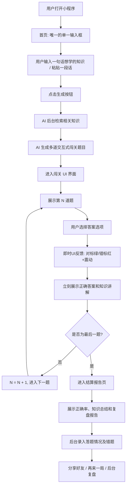

# 交互式AI闯关学习微信小程序需求分析文档 

**UI 设计文档（2026-05-26）：** [UI设计文档索引.md](./UI设计文档索引.md) · [UI设计风格与DesignSystem.md](./UI设计风格与DesignSystem.md) · [UI页面原型说明.md](./UI页面原型说明.md) · [UI-HTML原型实施指引.md](./UI-HTML原型实施指引.md)

### 人工需求分析

> 这是我人工确认的，相对重要的需求，不要忽略

## 一、 需求背景与核心定位

### 1. 核心痛点与解法
* **痛点（信息消化不良）：** 泛知识时代，用户面对长篇推文、报告或学习资料时，被动阅读易疲劳，且缺乏即时反馈，“收藏从未停止，阅读从未开始”。
* **解法（以测代学）：** 利用 AI 自动通过交互式问答闯关游戏的方式，让用户更轻松地学习他想学的任何知识，从而帮助大家随时随地学习。

### 2. 市场契机
* **生态优势：** 选择微信小程序的原因：随时随地使用 + 微信生态流量入口大 + 用户免安装 + 生态扶持 + 便于推广和分享。
* **项目延展性：** 本项目可以扩展为任何垂直领域的学习小程序（比如驾考宝典、面试题库、企业培训题库、XX 类知识学习、MBTI 测试等）。

---

## 二、 MVP 最小可行功能点 (核心闭环)
*MVP 阶段的最高原则是“路径最短”，仅保留单兵作战的极简体验，确保产品能一口气跑通上线。*

### 1. 极简输入端 (知识获取)
> `todo:用户通过一句话描述想学的知识`

* **单一输入框：** 首页仅保留一个极简的文本输入框。用户可以自由输入一个他想学的知识（可以是一句话、一段话、甚至是一个文档/一个视频/一个网页的内容提取）。在 MVP 跑通阶段，优先引导用户通过“一句话”来触发核心流程。

### 2. AI 极速生成引擎 (核心大脑)

* **全网知识检索与出题：** AI 自动从全网或者特定的信息源获取知识。随后，AI 自动生成交互式问答闯关的题目、选项和答案，通过提问引导来增加用户学习的趣味性。
* ~~**内容合规过滤（强依赖）：** 接入微信官方 `msgSecCheck` 接口，对用户输入文本和 AI 生成内容进行双向敏感词拦截，防范封号红线。~~
  > `todo:暂时先不用` （MVP阶段暂缓开发，后续根据上线要求视情况补充）
* ~~**题目缓存复用：** 相同 URL 被再次提交时，直接读取云数据库历史题库，实现“秒开”。~~
  > `todo:暂时先不用` （MVP阶段暂缓开发，每次均实时生成）

### 3. 沉浸式单人闯关流 (用户体验)
* **卡片式答题：** 每次屏幕仅展示一题，用户可以自由答题闯关。
* **即时正误反馈与讲解：** 每道题目选择后立刻给出正确答案和知识讲解（答错也有知识讲解）。答对标绿并伴随爽感音效，答错标红伴随震动。

### 4. 轻量级结算与复盘 (沉淀与留存)
* **结算战报与复盘：** 通关之后会生成一个知识总结和复盘报告，用户可以分享给好友。用户可以在后台分析自己所学的知识和答题情况，便于日后复盘，还可以生成报告。

---

## 三、 后续扩展功能点 (优先级规划)

> `todo:最开始应该跑通核心业务流程，完成用户输入一句话 => 生成题目和答题 => 生成报告的完整闭环，其他功能都是非核心`

**执行说明：** 以下功能均属于非核心模块，严格排期在核心闭环（一句话输入->生成->答题->报告）完全跑通且验证无误后，再做探索。

| 优先级 | 功能模块           | 功能详细说明                                                 | 业务价值                                     |
| :----- | :----------------- | :----------------------------------------------------------- | :------------------------------------------- |
| **P1** | **RAG 知识库**     | 允许输入知识库来生成题目（RAG）：可以用于企业培训、特定题库准备、考试复习等。 | 满足垂直领域的深度学习与 B 端需求。          |
| **P2** | **商业化盈利**     | 充值 VIP 进行盈利。                                          | 跑通商业闭环，覆盖 AI 算力与服务器成本。     |
| **P2** | **AI 生图辅助**    | AI 生图，比如应用到题目和选项中：可以根据知识的类型选择是否生成图片，可以用于刷英语单词等。 | 提升视觉体验，加强记忆留存。                 |
| **P3** | **多元互动与社交** | 多人对战 PK、排行榜、数字人、语音读题。                      | 丰富游戏化维度，利用攀比心理提升裂变与日活。 |

---

## 四、 用户操作具体流程图

> `todo:前期主页就一个输入框，不用选择模式，后面再拓展`

**执行说明：** 流程图已剔除剪贴板识别、URL解析、缓存判断和合规检测，呈现最纯粹的单线核心流。

## 五、 需求功能核对清单 (核心闭环 MVP 任务列表)

### 🛠️ 前端开发 (微信小程序端)

- [ ] **首页模块：** 极简 UI 设计，仅保留单一文本输入框与“开始学习”提交按钮。
- [ ] **答题卡片模块：** 单题展示逻辑（题干、选项动态渲染）。
- [ ] **交互动效模块：** 选项点击后的颜色反馈（正确绿/错误红）、手机震动调用接口。
- [ ] **解析反馈模块：** 答题后立刻在下方展示正确答案与 AI 知识讲解。
- [ ] **结算中心模块：** 通关数据统计页面（正确率、总结报告渲染）。
- [ ] **复盘中心模块：** “我的错题/答题分析”列表页及数据展示。

### ⚙️ 后端开发

- [ ] **数据接收转发：** 接收前端一句话输入，调用 AI 接口处理耗时请求，需配置合理的超时处理机制。
- [ ] **数据存储：** 用户每次通关的答题记录、正确率统计与错题本 CRUD 接口开发。

### 🧠 AI 大模型集成

- [ ] **知识检索与Prompt设计：** 编写系统提示词，要求模型根据用户输入的“一句话”，首先自主获取/补充相关知识，随后输出固定格式的问答题（推荐 JSON 格式，必须包含题干、选项、正确答案及通俗解析）。
- [ ] **API 联调：** 接入大语言模型 API，调优出题逻辑，确保题目不产生幻觉且符合提问引导机制。