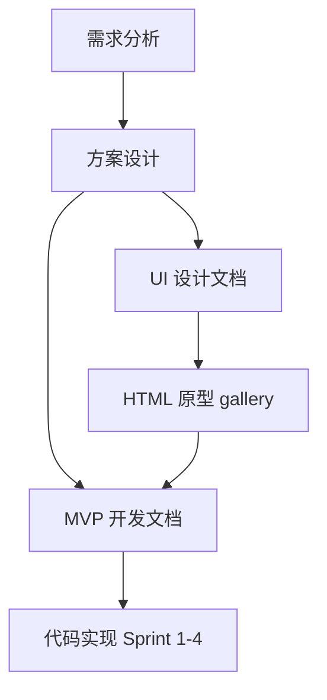

# 知练（KnowPractice）— 文档总索引

> **产品品牌：** 知练（KnowPractice）。对外主名「知练」；「闯关」为关卡式练测交互说法。

| 版本 | 日期 | 说明 |
| ---- | ---- | ---- |
| v1.0.0 | 2026-05-29 | 新增 MVP 开发文档三件套；串联需求 / 方案 / UI / 开发 |

---

## 一、阅读路线

**当前阶段：** 需求、方案、UI 原型与 **MVP 开发文档** 已就绪；**代码尚未启动**。

---

## 二、文档清单

### 2.1 产品与需求

| 文档 | 路径 | 说明 |
| ---- | ---- | ---- |
| 需求分析（合并精简版） | [交互式AI闯关学习微信小程序需求分析文档 (合并精简版).md](./交互式AI闯关学习微信小程序需求分析文档%20(合并精简版).md) | MVP 功能点、流程图、优先级 |
| 方案设计 | [交互式AI闯关学习微信小程序方案设计文档.md](./交互式AI闯关学习微信小程序方案设计文档.md) | 技术选型、LangChain、§6 前端交互、§7–8 Sprint |
| 产品需求（简化） | [交互式AI闯关学习微信小程序产品需求文档 (简化).md](./交互式AI闯关学习微信小程序产品需求文档%20(简化).md) | 早期 PRD |
| 产品需求（深度分析） | [交互式AI闯关学习微信小程序产品需求文档（深度分析） .md](./交互式AI闯关学习微信小程序产品需求文档（深度分析）%20.md) | 扩展思考 |

### 2.2 UI 设计

| 文档 | 路径 | 说明 |
| ---- | ---- | ---- |
| **UI 设计文档索引** | [UI设计文档索引.md](./UI设计文档索引.md) | UI 三件套导航、10 项设计决策 |
| 设计风格与 Design System | [UI设计风格与DesignSystem.md](./UI设计风格与DesignSystem.md) | Bento Token、组件、文案 |
| 页面原型说明 | [UI页面原型说明.md](./UI页面原型说明.md) | MVP 9 屏 + 扩展线框、检查表 |
| HTML 原型实施指引 | [UI-HTML原型实施指引.md](./UI-HTML原型实施指引.md) | gallery 预览与验收 |
| HTML 原型迭代清单 | [UI-HTML原型迭代清单.md](./UI-HTML原型迭代清单.md) | 原型里程碑 |
| UI 设计规范 | [UI设计规范文档.md](./UI设计规范文档.md) | 补充规范 |

**静态原型：** [`../prototypes/index.html`](../prototypes/index.html)

### 2.3 MVP 开发（文档先行）

| 文档 | 路径 | 说明 |
| ---- | ---- | ---- |
| **MVP 开发实施指南** | [MVP开发实施指南.md](./MVP开发实施指南.md) | Sprint 1–4、G0–G4、排期、风险、环境 |
| MVP 后端 API 与数据契约 | [MVP后端API与数据契约.md](./MVP后端API与数据契约.md) | 接口、Schema、Prompt、LangChain |
| MVP 前端实现指引 | [MVP前端实现指引.md](./MVP前端实现指引.md) | 页面、组件、storage、UI 映射 |

---

## 三、按角色推荐阅读

| 角色 | 推荐阅读顺序 |
| ---- | ------------ |
| 产品 / 评审 | 需求分析 → 方案 §一–三 → UI 页面原型说明 |
| 前端开发 | MVP 开发实施指南 → MVP 前端实现指引 → UI Design System → `prototypes/01_*` |
| 后端 / AI | MVP 开发实施指南 → MVP 后端 API 与数据契约 → 方案 §四–五 |
| 全栈闭环 | 开发实施指南全文 → 前后端两份指引 → 联调检查清单 |

---

## 四、MVP 开发闸门速查

| 闸门 | 目标 | 详见 |
| ---- | ---- | ---- |
| G0 | uni-app 四页跳转 | [开发实施指南 §三](./MVP开发实施指南.md#三验收闸门-g0g4) |
| G1 | 后端 generate/report | [后端 API §九](./MVP后端API与数据契约.md#九g1-验收清单) |
| G2 | Mock 走完 10 题 | [前端指引 §十四](./MVP前端实现指引.md#十四g0--g2-验收清单) |
| G3 | 真实 AI 联调 | [开发实施指南 §四 Sprint 3](./MVP开发实施指南.md#sprint-3--前后端联调g32-天) |
| G4 | 完整闭环可演示 | [开发实施指南 §四 Sprint 4](./MVP开发实施指南.md#sprint-4--复盘报告--打磨g42-3-天) |

---

## 五、修订记录

| 版本 | 日期 | 说明 |
| ---- | ---- | ---- |
| v1.0.0 | 2026-05-29 | 初版文档总索引；纳入 MVP 开发三件套 |
